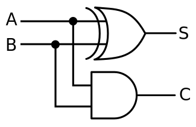

# 강의 요약

> 1주차 겸 개요

```text
요즘 4차 산업으로 인공지능 등을 많이 얘기하는데 도대체 우리가 사는 세상에 이런 기술들이 어떤 영향을 주는지 정확하게 이해를 해야 우리에게 유리하게 사용할 수 있다고 봅니다. 그래서 이번 시간에는 컴퓨팅을 얘기하고자 합니다.

여러분이 듣고 있는 강의를 통해 프로그래밍을 전문가 수준으로 해낸다는 건 아니에요, "교양으로 이 정도는 알아야 두면 좋겠다." 싶을 정도로 가르칠 생각입니다.

오늘은 컴퓨팅의 본질적인 부분을 잠시 소개하려고 해요. 컴퓨팅이라는 분야가 보통은 기술적인 분야로 이해를 하는데, 사실 컴퓨팅이라는 분야가 여러 이름으로 불리고 있어요. IT로 불리기도 하고, 정보통신, 정보과학, 컴퓨터 과학 등 여러 가지 용어로 불리다 보니까 이런 부분들이 어떤 시각으로 붙여진 이름인지 전체적인 경계도 잡기 어렵습니다.

많은 사람이 컴퓨팅에 대해 오해를 하고 있어요. "저 사람은 컴퓨터를 잘 다루니까 컴퓨터 전문가다." 이렇게 말하는데 그건 기능적인 거고 기술적인 건 아니에요. 실질적으로 컴퓨팅에 대한 본질은 아는 사람은 그렇게 많지 않다고 생각을 해요. 사실 컴퓨터를 전공한 사람도 컴퓨팅에 대해 잘 모르고 단지 주어진 대로 공부하고 그 기반의 기술을 쌓고 있는 게 아닌가 싶습니다.

사람들이 컴퓨팅이라는 분야를 조금 더 이해했으면 좋겠는데, 컴퓨팅은 실제로 하나의 학문 분야입니다. 보통 학문이라 하면 탐구하고 관심을 보이는 분야라고 해요. 또한 모든 학문이 주된 탐구 대상을 가지고 있습니다. 그래서 그 학문의 이름은 추정하기 쉬운 이름으로 잡는 편이에요. 예를 들어 물리학이면 "물리적인 세계, 물리적인 현상을 대상으로 해서 그 밑바닥을 들여다보는 학문이구나" 사회학, 교육학도 그렇습니다.

근데 이 컴퓨팅 쪽은 공학 및 과학, 정보 등 워낙 이름이 다양합니다.

컴퓨팅의 선도적인 역할을 하는 국가는 대부분 영어권입니다. 수준 높은, 앞서있는 연구 자료도 이쪽에서 많이 나와요. 그래서 컴퓨팅의 대표적인 분야 중의 하나가 컴퓨터 과학입니다. 또 다른 말로 정보과학, 정보 매트릭스, 컴퓨터 공학이라고 해요. 학문의 이름만 놓고 보면 뭐가 주 탐구 대상이라고 드냐면 " 컴퓨터 과학은 컴퓨터를 다루는 학문이구나" "정보 과학은 정보를 주로 다루는 학문이구나!"라고 오해하기 쉬워요.
```

### 정리
```
1. 계산하는 건 상태 변화의 과정
2. 어떤 사람은 빨리 풀고,
3. 어떤 사람은 좀 더디게 풀고,
4. 풀줄 몰라서 헤메는 사람도 있음
5. 계산 능력의 차이
```

> 2주차, Processing setup method with Jupyter

교수님이 전 시간 개요 잠시 설명하고 프로세싱 소개 하는 동안 pipenv-프로세싱-주피터 삽질해 봄.

```fish
brew cask install porcessing
# Tools -> install "processing-java"

pipenv install -e .
pipenv shell

python3 -m calysto_processing install

which processing-java
/usr/local/bin/porcessing-java

set -x PROCESSING_JAVA /usr/local/bin/processing-java

jupyter notbook
```

> 5주차, 4월 11일

튜링기계 배웠어요.

> 7주차, 25일

Transform, 회전 관련 기능 다뤄봄.

- `translate()`
- `rotate(radians(degree))`
- `pushMatrix()`, `popMatrix()`

```
교수님> 두번째 과제는 회전 애니매이션으로 할게요~
베타> 시공조아~
```

[strom](https://github.com/BetaF1sh/strom) 제출함.

> 13주차, 2진수의 보수법으로 음수 표현하기
>
> 참고한 자료 : [2의 보수법으로 음수 표현하기 - ecowiki](http://www.ecogwiki.com/2의_보수법으로_음수_표현하기)

1. 모든 수를 뒤집는다. 예를 들어 `01110` `->` `10001`
2. 1추가 :  `10001` 였다면 `10010`

컴퓨터는 메모리가 유한하기 때문에 무한하게 긴 수는 존재할 수 없다.

그래서, 양 끝의 수를 적절히 잘라야 한다. 예를 들어 8비트 정수라면 `-128` 에서 `127` 구간 자름. 

### 인코딩 흐름


> 사진 출처 : _[Two's complement addition overflow in C - Stack Overflow](https://stackoverflow.com/a/11464365/5498707)_

8비트에서 127에서 -128로 자연스럽게 넘어가고

0은 `00000000`인데 -1은 `11111111` 이유가 이거다.

> 14주차, 논리 게이트
>
> _아래 백터 이미지들은 [가산기 - 위키백과](https://ko.wikipedia.org/wiki/가산기)에서 가져옴. 원 저작자 [사용자:Cburnett](https://en.wikipedia.org/wiki/User:Cburnett) 에 의해 [CC BY-SA 3.0](http://creativecommons.org/licenses/by-sa/3.0/) 를 따라 동일한 라이선스를 이미지에 재부여함._

2진수 덧셈 회로 : 1101 + 0101 = 10000

AND, OR, NOT 소자만을 이용해서 만들어본다.

### 반가산기 _half-adder_

|       회로도        |
| :-----------------: |
|  |
### 전가산기 _full-adder_

|       회로도        |        결선도 기호        |
| :-----------------: | :-----------------------: |
|  |  |

### 복수비트의 가산기

|           4비트 가산기            |
| :-------------------------------: |
|  |

이전 가산기의 연산 결과를 기다려야함. 비트 수가 커질수록 연산이 느려짐.

> 15주차

### 부호화와 복호화

인코딩 : 정보를 특정 체계에 맞춰 표현

디코딩 : 코드에 담긴 정보를 추출 및 인식

### 문제 해결의 흐름

상향식(bottom-up) : 소규모 `->` 대규모

​	여러 라이브러리, 코드 조각을 모아 프로그램 개발

하향식(top-down) : 대규모 `->` 소규모

​	동적 프로그래밍, 로드 밸런싱

### 컴퓨터 시스템의 기본 목적

계산 활동의 효과적 대행

시스템에 대한 이해는 **하향식**으로 접근할 필요가 있음.
