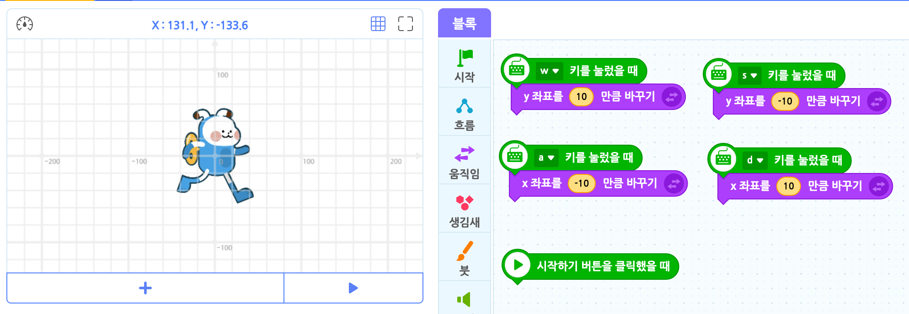

# 함수

| 과제 주제 | 제출자 정보 |
| :--: | :--: |
| 중등 정보 교과와 관련해 수학과 연계시켜 다룰 수 있는 내용 요소 및 교수학습 방안 정리 | 김무훈, 2018103277 |

우리는 컴퓨터를 사용할 때 마우스와 키보드 등 다양한 외부 입력 장치를 통해 자료를 입력받고, 입력된 내용을 바탕으로 컴퓨터와 처리한 후 모니터와 스피커 등과 같은 출력 장치로 실행 결과를 확인하게 된다.

이는 중등 수학에서 다루는 함수와 동등한 개념으로, 위 문단의 과정을 ${y=f(x)}$ 로 아래 문장과 같이 재해석 할 수 있다.

> ### _우리는 컴퓨터에 ${X}$를 입력하여, 입력된 내용을 반영하는 ${f}$ 프로그램으로 결과 ${y}$가 출력되었다._

### 예제 : 상하좌우 조작 함수



`w, a, s, d` 키를 사용하여 인형을 조작하는 예제이다.

이 예제에서는 Entry[1]라는 블록형 프로그래밍 도구를 선택하였다.

`'특정한' 키를 눌렀을 때` - 이 구문은 '특정한' 키를 눌렀을 때 지정된 명령을 실행하는 함수라 설명할 수 있다. 예를 하나 들자면 w를 입력하면 y 방향으로 10만큼 움직이는 방식이다.

<!-- 하지만 이 예제는 각기 다른 매개변수에 따른 '고정된 명령'이기에 중등 수학에서 일반적으로 다루는 함수 보단 고등 교과에서 다루는 집합에서의 개념과 더 유사하다. -->

위 엔트리 블럭 코드를 파이썬으로 변환하면 아래와 같다.

```py
import Entry

def when_start():
    pass

def when_press_key("W"):
    Entry.add_y("10")

def when_press_key("S"):
    Entry.add_y("-10")

def when_press_key("A"):
    Entry.add_x("-10")

def when_press_key("D"):
    Entry.add_x("10")
```

## 교수 방안

중등 수학에서의 함수 개념과 연계시켜 프로그래밍에 대한 수학적 배경을 이야기한다.

<!-- 다만 첫 예제에서 지적한 '고정된 명령'처럼 일반적으로 알고 있는 함수와 거리 -->
1: https://playentry.org
