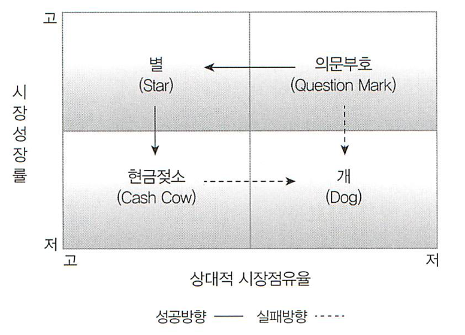

# 수업 개요
추가바람

## 1주차, 3월 14일
> 이-비즈니스 : 인터넷을 통해서 상품 창출

### 1장 e-비즈니스의 이해
- 인터넷과 모바일
- 이-비즈니스의 출현 배경 및 발전 과정

#### 옴니채널 : 오프라인 <-> 온라인 서비스
> 고객 중심
- 쇼루밍(Showrooming) : 오프라인 정보 탐색 -> 온라인 구입
    - 모루밍 (Mobile)
    - 웹루밍(Web)

- 역쇼루밍 : 온라인 정보 탐색 -> 오프라인 구입

유사 용어 : O2O(Online to Offline), 기업(기술) 중심의 서비스?

~~경영이라 그런지 기술을 기업이라 지칭하는 것 같다.~~

#### 인터넷 특성
1. 매개 기술
    B2B, B2C, B2G etc...
    
    쌍방향성 상호 작용이 큰 특징, 단방향 상호연결보다 우위성을 가짐

2. 보편성

    세계를 확대하고 축소할 수 있음.

3. 네트워크 외부성

    사용자의 수가(수요) 많을 수록 가치 증가 및 양질 증가

4. 유통 경로

    디지털로 생산, 유통, 소비, 저장되는 디지털 상품

5. 시간 조정
    시간 조절

4. 시간의 비대칭성

7. 무한대의 가상적 수용능력
8. 저비용 표준
9. 창조적 파괴

    과거의 것이 우수한 새로운 것으로 대체되는 것을 의미
    예시 : 종이 신문 -> 인터넷 신문

#### 모바일 특성
1. 개인화
    맞춤 서비스
2. 편재성
    시간이나 장소에 상관없이 언제 어디서나 정보, 커뮤니케이션 가능함.

### 2절 이-비즈니스의 출현 배경 및 발전 과정

전자상거래, 이 비즈니스

#### 전통적 상거래와 이-비즈니스 비교

|| 전통적 상거래 | 이-비즈니스 |
|:--:|:--:|:--:|
| 유통경로 | 공급자 -> 도, 소매상 -> 수요자 | 공급자 -> 수요자 |

#### 이-비즈니스 상품
- 물리적 상품
    - 배송 파손, 분실 등

- 디지털 상품
    - 불법 복제

#### 버저닝
**시간, 성능 및 기능 등의 소프트웨어에 대한 범위 제한, 다양한 구입 플랜**

#### 번들링
패키지 판매 + 고객의 수요 및 가치를 반영한 마케팅

#### 이-비즈니스 거래 상대
> B2B, B2C ...

- B(usiness) : 기업
- G(ov) : 정부
- C(ostom) : 고객

#### 이-비즈니스의 경영 패러다임

기업중심적 마케팅 컨셉트
1. 제품개념(제작)
2. 판매개념(마케팅)
3. 무형자산
4. 수확체증의 원리

## 2주차, 3월 21일

### 1절. e-비즈니스 전략

- SWOT(Strength. Weakness. Opportunity. Threat) 분석
  - 내부환경 : (내적인) 강점, 약점
  - 외부환경 : 기회 요인, 위협 요인 분석

    직매입 : 독점적인 요소? 매장주가 직접 물량을 구입해서 판매

- SO, SW 전략 등등 : 강점과 장점(기회요인)을 살려요.

  T/S 전략 : 강점을 가지고 위협을 최소화하는 전략

  OW 전략 : 약점을 보완하여 기회를 살리는, 자사의 역량을 강화하는 전략이에요.

#### 전략 정의

- 다섯 가지 포스 모델
  - 신규 진입자의 위협 : 진입장벽이 낮다 / 진입장벽이 높다.
  - 대체 상품의 위협 : 커피 -> 홍차, 비행기 -> 배, 택시 -> 버스
  - 구매/공급자의 교섭력
  - 기업간의 경쟁 강도

#### 경쟁전략

- 제품/시장 확장 그리드 : 앤소프 매트릭스

|           | 기존 제품 |  신제품   |
| :-------: | :-------: | :-------: |
| 기존 시장 | 시장 침투 | 제품 개발 |
| 신규 시장 | 시장 개발 |  다각화   |

##### 제품 포트폴리오 전략

> 이거 시험 나오면 시계 반대 방향 
>
> 

- 의문표 : 도입기
- 별 : 성장 중으으임, 투자 진행 중
- 자금젖소, [Cash cow, Wikipedia](https://en.wikipedia.org/wiki/Cash_cow) : 정점에 도달, 돈줄은 안정적임. 별에 재투자
- 개 : 쇠퇴됨.

### 2절, e-비즈니스 모델

1. 고객가치
2. 범위
3. 가격
4. 수익원천
   1. 직접 판매 수익
   2. 수수료
   3. 광고수익
   4. 가입비 및 이용료
5. 연계된 활동

#### 산업

- 포털서비스
- 전자상거래
- ...

### 3절, m-비즈니스

모바일 비즈니스

- 컨텐츠
- 플렛폼
- 디바이스

