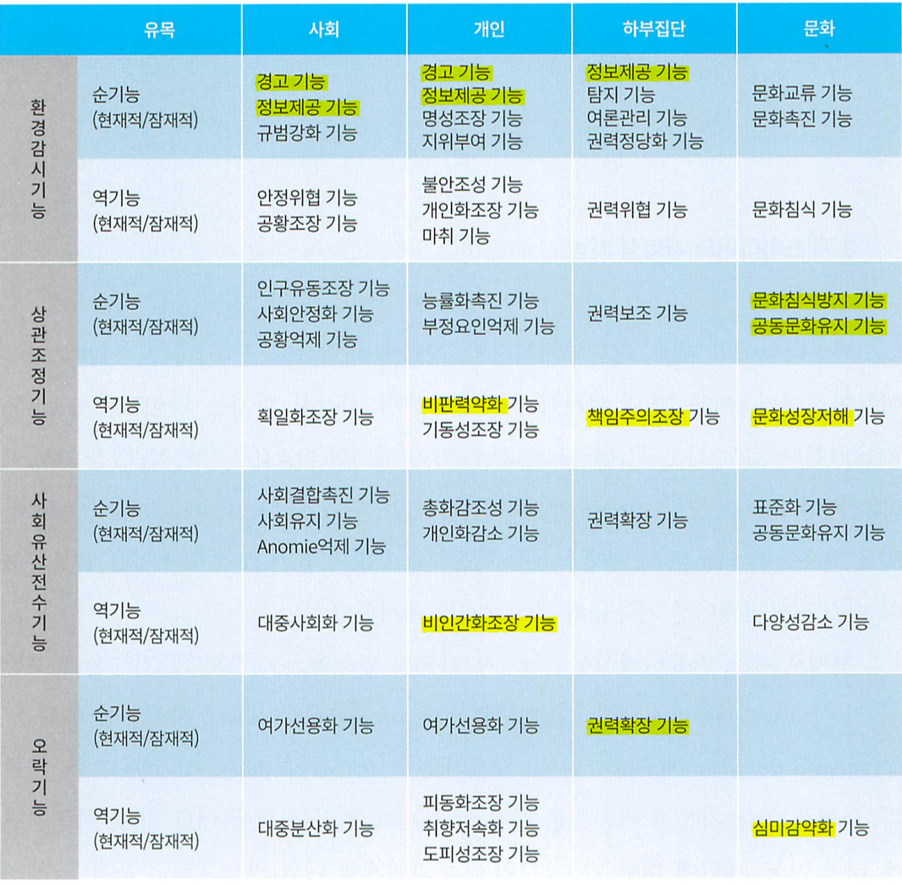

# 강의 요약

> 2주차, 3월 12일
> 
>매스 커뮤니케이션과 매스미디어는 같지 않다.

### 매스 미디어
불특정 대다수를 타겟으로 한 매체
> 대중 매체(大衆媒體)는 대중전달매체(大衆傳達媒體)의 줄임말로, 조직화되지 않은 일반 대중을 상대로 하여 대량의 정보 및 시사내용, 당대의 이슈 등을 전달하는 역할을 담당하는 매체를 말한다. **매스 미디어**(mass media)라고도 부른다. - [대중매체, 위키백과](https://ko.wikipedia.org/wiki/대중매체)

### 매스컴
대중 전달, 대중매체로 일어나는 사회현상

매스 미디어로 이루어지는 대화 과정

> 대중 전달을 영어 명칭인 매스 커뮤니케이션의 약자를 따서 **매스컴**이라 흔히 부르기도 한다. 일부에서 **매스컴**이란 단어를 언론 기관의 의미로 사용하는 경우가 있는데, 혼동의 여지가 있으므로 피하는 것이 좋다. - [대중 전달, 위키백과](https://ko.wikipedia.org/wiki/대중%20전달)

공식적인 업무는 문서나 회의에서.

 비공식적인 업무는 혈연 등 개인에 속함.

> 3주차, 3월 19일

> 매스미디어의 기능을 배웠어요.
>
> Mass media -> network communication

17-29p 집중적으로 읽어보면 도움되요. 시험출제 할 수도 있어요.

### SMCR 모델

- Sender : 송신자 및 개발자

- Message : 리소스

- Channel : 대화 통로, 수단

- Receiver : 클라이언트

  [위키백과, SMCR 모델](https://ko.wikipedia.org/wiki/%EC%BB%A4%EB%AE%A4%EB%8B%88%EC%BC%80%EC%9D%B4%EC%85%98_%EB%AA%A8%ED%98%95#Berlo)

### 매스 커뮤니케이션의 기능

> 44-55p 보세요.
>
> 44p (아래) 표는 가려가면서 익혀보세요. 그냥 외우지는 말고..
>
> 

- 환경감시 : 주변환경의 위험을 알려요.
  - 순기능 : 경고, 일기예보 등 생활의 편리를 도모해요.
  - 역기능 : 개인의 불안, 특정 국가나 사회의 **안정을 위협하**거나 **문화를 변질**하는 등의 영향이에요.
- 상관조정 : 사실 보도의 차원을 넘어서 **해석하고, 대응책을 처방해 대중의 태도 형성**에 영향을 줘요.
  - 순기능 : **논평**
  - 역기능 : 순기능에 왜곡된 편견이 개입되면 야기되요.
- 사회유산 전수 : 각종정보를 다음세대에 전수해요.
  - 사회화의 기능 : 교육의 도구로 이용됨을 의미해요.
  - **사회통제의 효과** : 범죄행위를 경각시킴으로써 통제를 강화할 수 있어요.
  - 순기능 : 사회결합 촉진, 표준화 기능
  - 역기능 : 비인간화조장, 문화 다양성 감소 기능
- 오락기능
  - 의존적인 오락은 **문화적 순응주의**를 야기해요 :
    - 피동화조장/취양저속화 기능

범죄행위의 알림은 `환경감시`, 그 행위의 통제는 `사회유산 전수`에요.

> 4주차, 3월 26일
>
> 매스미디어의 효과에 대해 배웠어요.

### 대중 전달 효과이론의 발전과정

| 년도      | 효과         | 영향      |
| --------- | ------------ | --------- |
| 1915 ~ 30 | 탄환이론     | 매우 큼   |
| 1940 ~ 60 | 한정효과이론 | 매우 작음 |
| 1970 ~ 75 | 중효과이론   | 보통      |
| 1980 ~    | 강효과이론   | 큼        |

### 숙지해야 될 개념

- 배양효과 : 개인의 사고가 미디어에 동화되는 거에요.
- 침묵의 나선효과 : 매스 미디어가 여론 형성에 강력한 영향을 미쳐요.
- 점화(priming) 효과 : 특정 이슈에만 집중해 평가 기준을 새로이 제공해요.
- 제 3자 효과
  - **지각** : 제 3자인 타인에게 더 큰 영향력이 있다고 지각함.
  - 지각을 함으로서 태도와 행동의 변화가 **검열과 규제쪽으로** 나타나요.
- 틀짓기 : 이데올로기적, 정치적 의도에 따른 편향된 보도

> 5주차, 4월 2일
>
> 신문에 대해..

게이트키핑 : 정보가 매스미디어로 대중에게 오는 취사선택 과정이에요.

종이 신문은 기자가 주체가 되요.

다만 인터넷 신문은 독자가 정보를 직접 선별하는 주체가 되요.

> 6주차, 4월 9일

### 시험 얘기함

- [x] 1장 - 29p까지
- [x] 2, 3장 쭉 읽어보세요~
- [x] 4장 X
- [x] 5장

### 신문 II

게이트키핑 시험에 나올 수 있어요.

인터넷 신문은 게이트키핑의 주체가 독자가 될 수 있어요.

### 레포트 제때 작성하세요!

신문기사 제목, 부제목 정도만 첨부하면 되요.

주제에 대한 5일치, 약2~4가지 기사 종합 비평하면 됩니다.

> 9주차, 4월 30일

> 프린트의 방송 2 부분 수업함.
>
> 케이블 텔레비전_, 위성방송_ 내요

### 방송 편성

- 줄띠 편성 : 일주일에 5일 이상 같은 시간대에 같은 프로그램을 고정 편성. 전통적인 전략
- 순환 편성 : (일정 및 비일정한) 여러 시간대에 차례 편성하는 일.
- 마라톤 편성 : 2~3편 이상으로 이어서 편성.
- 채널 간 편성 전략 : 채널을 넘어가는 편성 전략
  - 실력 편성 : 다른 네트워크가 이미 ‘요새화’한 시간대의 **동일 시청자를 대상**으로 **같은 유형의 프로그램을 맞물려 편성**하는 정면 도전형 전략
  - 보완편성 :  ?
  - 함포사격용 편성 : 경쟁 프로그램의 짧은 시간을 제압하기 위해 90분에서 2시간 정도의 편성
  - 엇물리기 편성 : 경쟁국의 프로그램보다 조금 앞서 편성하거나 아예 상대방 프로그램의 가운데쯤에 걸쳐서

> 12주차, 5월 21일

> 인터넷의 역기능 시험 내요~
>
> - **개인정보 보호, 사이버 테러**
> - 인터넷 저작권
> - 디지털 격차, 스팸메일?
>
> 생각하는 문제 낼거에요. (p. 268-276)
>
> - **보안 비평**으로 문제 내요~
>   - DDoS 패치 나올려나??
> - **행정편의 주의로 인한 저예산, 관리 소홀 문제** : 보안 장치 이전에, 결함의 여지를 최소한으로 두기 위해 기술적인 질을 낮추는 (시스템 통합 사업의) 하청 구조를 없에는 방안이 가장 이상적이다.

### 인터넷과 웹

- 익명성
- 저작권
- 보안

### 뉴미디어의 등장과 정보사회

> "뉴미디어의 종류" 하나 시험으로 내요~ (인터넷 제외)
>
> - 방송 : 케이블 TV, 위성방송
> - _통신 : ~~유무선 인터넷~~, VoIP(mVoIP : 인터넷 메신저), LTE_
> - 방송 + 통신 : IPTV
> - 소셜 미디어 : 블로그, 페이스북, 트위터
> - N-Screen : (모바일, 태블릿 PC 타겟) 스트리밍 서비스
>   - 넷플릭스, _유튜브_
>
> 뉴미디어의 **긍정적 특성, 비관적 내용**도 내요~

#### 특성 및 낙관적

- 비동시성(시간과 공간의 제약이 없음)
  - 예 "나중에 봐야지~"
- (탈 대중적인) 다양화된 콘텐츠
- (상호작용적인) 쌍방향성
- 종합화 : 별개의 매체들이 하나의 정보망으로 통합됨.

#### 비관적

- 필요 이상의 개인화, 사회중심지표가 사라짐
- 정보격차 : 삶의 질의 양극화를 초래함.
  - 정보 활용의 따른 혜택의 차이
  - **언어 격차** : 영어 가독 여부에 따른 정보 습득량의 차이

> 13주차

광고, PR, 선전, 퍼블리시티

공통점 : 설득 커뮤니케이션

### 전공에 따른 광고의 개념

경영 : 마케팅 기능

언론 : 커뮤니케이션 기능

산업 디자인 : 비주얼 아트

### 광고와 ? 의 차이점

1. 퍼블리시티
   1. 광고주가 보도 내용을 통재할 수 없어요.
   2. 통재 할 수 없는 분량 예측
2. 선전
   1. 자신을 밝히는 **광고주**를 명시하지 않아도 되요.
   2. 과장 및 허위보도 가능해요.
3. PR
   1. 굳이 나누지 않아요.
   2. 위기 관리, 로비, 헬스 커뮤니케이션

> 14주차, 6월 4일

### 매스미디어와 선거
