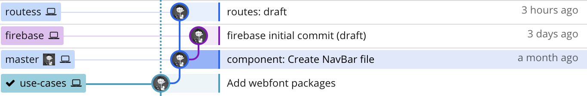
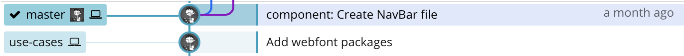

# Git 사용 시나리오 보고서

|  이름  |    학번    |             실행 환경              |
| :----: | :--------: | :--------------------------------: |
| 김무훈 | 2018103277 | git version 2.17.2 (Apple Git-113) |

## 개요

```bash
~/github/BetaFish/Jeju-Gallery-Tour master* ⇣
❯ git checkout -b use-cases
Switched to a new branch 'use-cases'

~/github/BetaFish/Jeju-Gallery-Tour use-cases*
❯ git log --oneline
ff35cb58b1ebd51649b20f96cc2bcbff6c784fa0 (HEAD -> use-cases, master)
```

- [GitHub - BetaF1sh/Jeju-Gallery-Tour](https://github.com/BetaF1sh/Jeju-Gallery-Tour)[1] 의 리소스를 활용하였고, 작업의 혼선을 예방하기 위해 `use-cases`라는 브랜치를 만들었습니다.

- 시나리오 작성을 마친 시점의 `master` 브랜치는 `ff35cb5` 라는 커밋 개체를 가리키고 있는 상태입니다.

- 텍스트 형식의 파일 포멧을 간편하게 보여주는 `bat`[2]이라는 도구를 사용했습니다 : [GitHub - sharkdp/bat: A cat(1) clone with wings.](https://github.com/sharkdp/bat)

- 브랜치의 시각화는 GitKaran이라는 Git GUI 클라이언트[3]를 시용했습니다.

**최하단에 첨부한** 커밋 리스트를 바탕으로, 아래처럼 축약하여 설명했습니다.

> `update-ref`로 HEAD의 직전 커밋인 `79591e` 를 변경한 결과, `use-cases` 브랜치가 `master`의 이전 커밋으로 전환했다는 것을 위 사진에서 알 수 있었다.

현재 터미널의 환경에서 부합되는 밝은 테마를 찾을 수 없어 마크다운의 코드 블럭으로 기술했습니다.

## `hash-object`

```bash
git hash-object [-t <type>] [-w] [--path=<file>|--no-filters] [--stdin [--literally]] [--] <file>…​
git hash-object [-t <type>] [-w] --stdin-paths [--no-filters]
```

인자로 받은 파일을 바탕으로 blob 개체를 만들어 `.git/objects` 디렉토리에 집어넣는 명령어이다.

blob 개체란 저장소의 모든 정보가 담긴 `.git/objects` 의 한 파일이다.

### 시나리오

```bash
❯ git hash-object -w src/router/index.js
dbf5513bf0f55bbd15a8545880a14ca1551358b7

❯ git cat-file -p dbf5513bf0f55bbd15a8545880a14ca1551358b7
import VueRouter from 'vue-router'

import Place from '@/components/Place.vue'
...
```

바로 아래에서 설명할 `cat-file` 명령어를 통해 저장이 잘 되었다는 것을 알 수 있었다.

## `cat-file`

```
git cat-file (-t [--allow-unknown-type]| -s [--allow-unknown-type]| -e | -p | <type> | --textconv | --filters ) [--path=<path>] <object>
git cat-file (--batch | --batch-check) [ --textconv | --filters ] [--follow-symlinks]
```

`cat <path>` 명령어처럼 blob 개체의 내용 또는 형태와 크기 정보를 알려주는 명령어

blob는 일반 텍스트 형식의 파일이 아니므로 `cat-file` 명령어가 존재한다.

`-t`는 개체의 형태를 보여주고, `-p`는 개체의 내용을 보여준다.

### 시나리오

```html
❯ find .git/objects -type f
.git/objects/0d/57af36b147ccbe21021be2cce54edddd05bd87 ... ❯ bat
.git/objects/0d/57af36b147ccbe21021be2cce54edddd05bd87
───────┬────────────────────────────────────────────────────────────────── │
File: .git/objects/0d/57af36b147ccbe21021be2cce54edddd05bd87
───────┼────────────────────────────────────────────────────────────────── 1 │
x^A]RM��0^P�� 2 │ ��ҕ6m�K^W^T� 3 │
�^SGn��cO�Q^]۲�^_�U�;�d?^P98Λ7ｱ�^Z׊��^O�6^D�7�`...
───────┴────────────────────────────────────────────────────────────────── ❯ git
cat-file -p 0d57af36b147ccbe21021be2cce54edddd05bd87
<template>
  <ul>
    <li
      v-for="tab in tabs"
      v-bind:class="{active: tab === selected}"
      v-on:click="onClickTab(tab)"
    >
      {{tab}}
    </li>
  </ul>
</template>
```

## `update-index`

```bash
git update-index
         [--add] [--remove | --force-remove] [--replace]
         [--refresh] [-q] [--unmerged] [--ignore-missing]
         [(--cacheinfo <mode>,<object>,<file>)…​]
         [--chmod=(+|-)x]
         [--[no-]assume-unchanged]
         [--[no-]skip-worktree]
         [--[no-]fsmonitor-valid]
         [--ignore-submodules]
         [--[no-]split-index]
         [--[no-|test-|force-]untracked-cache]
         [--[no-]fsmonitor]
         [--really-refresh] [--unresolve] [--again | -g]
         [--info-only] [--index-info]
         [-z] [--stdin] [--index-version <n>]
         [--verbose]
         [--] [<file>…​]
```

커밋에 들어갈 파일 콘텐츠를 작업 트리의 인덱스에 집어 넣는 명령어.

작업하고 있는 저장소의 폴더를 작업 트리(Work tree)라고 부르고, 저장소와 작업 트리 사이에 존재하는 공간을 인덱스(Index) 혹은 스테이징 구역(Staging area)라고 한다. 저장소에 변경 사항을 기록하기 위해서는, 기록하고자 하는 모든 변경 사항들이 '인덱스'에 존재해야 한다.

좀 더 사용자 친화적으로 해당 작업을 수행하는 `git add` 라는 명령어가 있다.

선택 인자로는 `--add`, `--remove` 등이 있다.

### 시나리오

```bash
❯ git status
On branch use-cases
Untracked files:
  (use "git add <file>..." to include in what will be committed)

    src/router/

❯ git update-index --add src/router/index.js

❯ git status
On branch use-cases
Changes to be committed:
  (use "git reset HEAD <file>..." to unstage)

    new file:   src/router/index.js
```

## `write-tree`

```bash
git write-tree [--missing-ok] [--prefix=<prefix>/]
```

현재의 인덱스를 사용하여 트리 개체를 생성한다.

트리 개체란 Git 의 데이터 모델의 한 개념으로 특정 시점의 파일 관계를 기록한다.

`write-tree` 명령 시점의 인덱스 정보를 바탕으로 만들어진다.

### 시나리오

```bash
❯ git write-tree
077338437ff3356ce93b3b76f99c1c6790dd194a

❯ git cat-file -p 077338437ff3356ce93b3b76f99c1c6790dd194a
100644 blob 9dee6464636efdc40e54434302615a0315d3fd14    .browserslistrc
100644 blob 185e6631928dca2f51224e61a3861cc88fa2b74e    .gitignore
100644 blob 8fb4b9373c6fdce5e1376ea4944c6bcc54fa3f26    .prettierrc
100644 blob b48fc204a506216c81776efcc5e696c5c429a54e    LICENSE
100644 blob b065e9c4365c00d46a6797c51783b1b4d0bfdc51    README.md
040000 tree ecb2f6eac25abd7f8f17396201f481f9aec70a4e    dist
100644 blob 76c19f791809b636877baba93619e56b0b2e51cc    package-lock.json
100644 blob 3f63d130022e676e83f320c8fddeb33384566401    package.json
100644 blob 5bfb8f62848e704d55379d060cf74ae6415bdf9d    postcss.config.js
040000 tree 1b99416e6c33295a1c38dc80946d72c79883d422    public
040000 tree 46d44c3eb44c4d7e095a6add3e385bef85c60737    src

❯ git cat-file -p ff35cb58
tree 6f605e6fb6b7fa8e0c85dff421beb7f16eee4b97
parent 79591ed3d8574536b01a9dc51cf0e0613a766a9f
author Muhun Kim <iam@muhun.kim> 1551935566 +0900
committer Muhun Kim <iam@muhun.kim> 1551935587 +0900
...
```

`write-tree` 로 생성된 트리 개체를 조회한 결과 현재의 인덱스에 속한 blob 혹은 tree 개체 리스트를 볼 수 있었다. 자세히 살펴보면 파일 이름과 해시 정보의 목록을 같이 저장한 것을 알 수 있었다.

그리고 커밋 개체를 조회했을 때 해당 개체의 상태와 연관된 트리 개체에 대한 정보가 나온다.

따라서 `write-tree` 는 스테이징 단계와 커밋이 완료되는 저장소 사이의 한 과정으로 수행되는 것으로 알 수 있었다.

## `read-tree`

```bash
git read-tree [[-m [--trivial] [--aggressive] | --reset | --prefix=<prefix>]
        [-u [--exclude-per-directory=<gitignore>] | -i]]
        [--index-output=<file>] [--no-sparse-checkout]
        (--empty | <tree-ish1> [<tree-ish2> [<tree-ish3>]])
```

Tree 개체를 읽어 준비 스테이징 구역에 추가하는 명령어. `--prefix` 옵션을 주면 Tree 개체를 하위 디렉토리로 추가할 수 있다.

### 시나리오

```bash
❯ git read-tree --prefix=master -u origin/master

❯ \ls -G
LICENSE           master            package.json      src
README.md         node_modules      postcss.config.js
dist              package-lock.json public

❯ ls master
LICENSE           dist              package.json      public
README.md         package-lock.json postcss.config.js src

❯ git status
On branch use-cases
Changes to be committed:
  (use "git reset HEAD <file>..." to unstage)

    new file:   master/.browserslistrc
    new file:   master/.gitignore
    new file:   master/.prettierrc
    new file:   master/LICENSE
    new file:   master/README.md
```

`-prefix=master` 선택 인자를 통해 `origin/master` 트리 개체를 `master` 라는 하위 디렉토리로 추가하고 스테이징 구역에 추가하였다.

## `log`

```bash
git log [<options>] [<revision range>] [[—] <path>…​]
```

커밋 로그를 보여주는 명령어.

### 옵션

이 명령은 `git rev-list` 명령에 적용 가능한 인자를 사용하여 어떻게 로그가 출력할지 정한다.

또한 `git diff- *`명령에 적용 가능한 옵션을 사용하여 각 커밋의 변경 사항을 표시하는 방법을 제어가 가능합니다.

> 더 자세한 옵션 리스트는 [Git - git-log Documentation](https://git-scm.com/docs/git-log#_options)[4] 에서 참고할 수 있다.

## `update-ref`

### 설명

특정 커밋 개체의 SHA-1 해시 값을 별칭으로 참조하게 도와주는 디렉터리인 `.git/refs`의 내부 정보를 갱신하는 명령어.

`.git/refs` 내부에는 현재 가리키는 해시 정보가 담긴 `heads/<브랜치 이름>` 와 태그의 해시 정보가 담긴 `tags` 디렉터리가 대표적으로 예를 들 수 있다.

브랜치를 전환하거나 새로운 커밋을 만드는 등 `.git/refs` 정보의 갱신이 필요한 명령이 내려졌을 때, 내부적으로 `update-ref` 명령어를 자동으로 실행하고, 갱신할 디렉토리를 인자에 넣는다.

### 시나리오

```bash
❯ bat .git/refs/heads/use-cases
───────┬──────────────────────────────────────────────────────────────────
       │ File: .git/refs/heads/use-cases
───────┼──────────────────────────────────────────────────────────────────
   1   │ ff35cb58b1ebd51649b20f96cc2bcbff6c784fa0
───────┴──────────────────────────────────────────────────────────────────

❯ git update-ref refs/heads/use-cases 79591

❯ bat .git/refs/heads/use-cases
───────┬──────────────────────────────────────────────────────────────────
       │ File: .git/refs/heads/use-cases
───────┼──────────────────────────────────────────────────────────────────
   1   │ 79591ed3d8574536b01a9dc51cf0e0613a766a9f
───────┴──────────────────────────────────────────────────────────────────
```



`update-ref`를 사용하여 HEAD의 직전 커밋인 `79591e` 로 변경했다.

위의 사진을 통해 `use-cases` 브랜치가 `master`의 이전 커밋으로 전환했다는 것을 알 수 있었다.

## `symbolic-ref`

```
git symbolic-ref [-m <reason>] <name> <ref>
git symbolic-ref [-q] [--short] <name>
git symbolic-ref --delete [-q] <name>
```

`.git/refs` 의 내부 정보를 읽거나, 수정하고 삭제하는 명령어이다.

`<name>` 인자만 주어지면 읽기만 하고 `<ref>` 정보까지 주어지면 수정도 가능하다.

### 사용 시나리오

```
❯ git symbolic-ref HEAD
refs/heads/use-cases

❯ git symbolic-ref HEAD refs/heads/master
```



HEAD가 가리키는 커밋을 `refs/heads/master`으로 이동해 `master` 브랜치로 전환되었다.

## 주석

1. https://github.com/BetaF1sh/Jeju-Gallery-Tour, BetaF1sh/Jeju-Gallery-Tour: 🌋 (WIP) Providing Jeju Island Gallery Tour mission to traveler

2. https://github.com/sharkdp/bat, sharkdp/bat: A cat(1) clone with wings.

3. https://www.gitkraken.com/git-client, Best Git Client 2019 - Features | GitKraken

4. https://git-scm.com/docs/git-log#_options, Git - git-log Documentation

---

## `ff35cb` ~ `753f7` 커밋 로그 첨부

```
ff35cb58b1ebd51649b20f96cc2bcbff6c784fa0 (HEAD -> use-cases, master) component:
79591ed3d8574536b01a9dc51cf0e0613a766a9f Add webfont packages
aa4b678fcc9a27da09ce51acd00ab2486398cd2d Initial dist subtree commit
753f7de74e0638598512173c945e3897c style: rem to em
```
